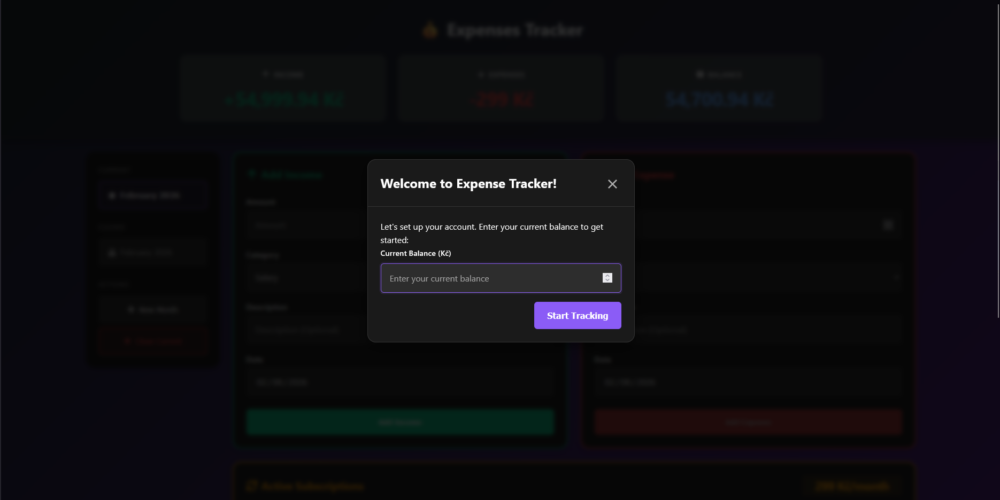
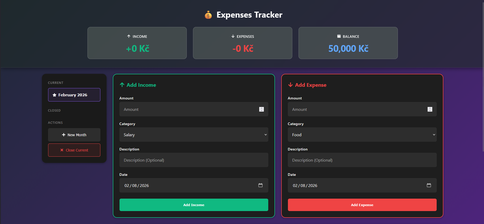
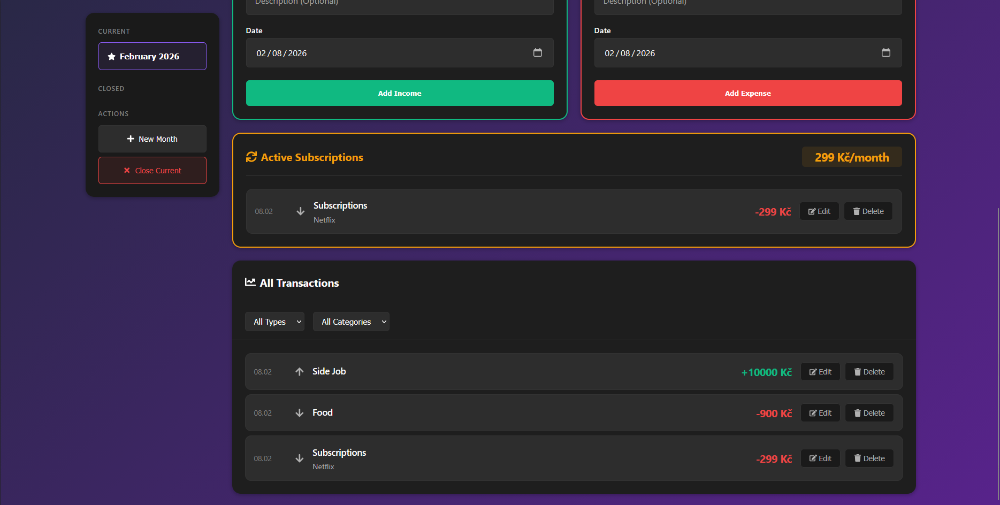
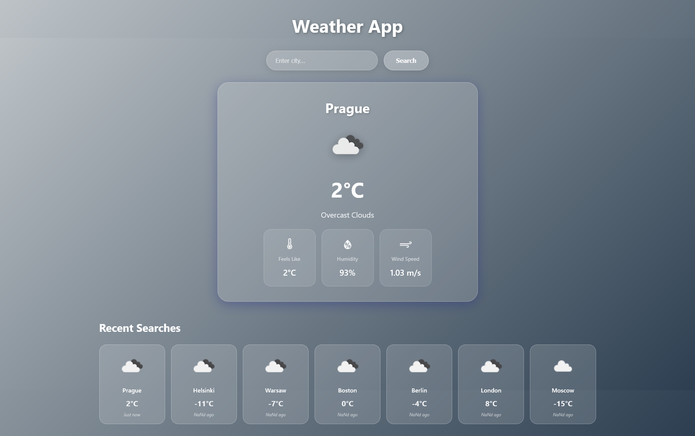
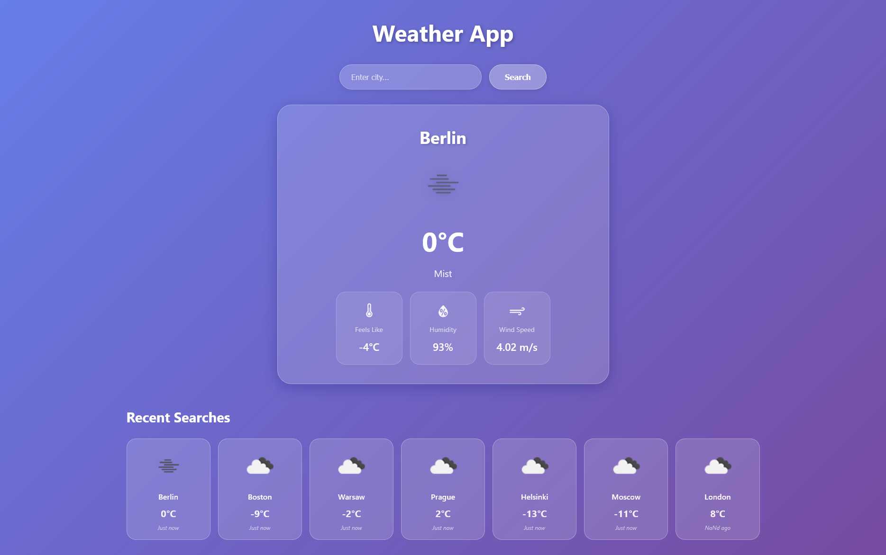

# React-TypeScript — Front-End Practice Projects


## Overview

**React-TypeScript** is a collection of practice projects built to master modern front-end development with React and TypeScript.

**Goal:** Build production-ready React applications while learning TypeScript, modern React patterns, and best practices.

---

## Repository & Live Demos

**Repository:** [LazyTanakaS/React-TypeScript](https://github.com/LazyTanakaS/React-TypeScript)  
**Live Demos:** _(Deploy to GitHub Pages or Vercel)_

---

## Project Goal

To develop practical front-end skills by building real-world applications using React, TypeScript, and modern web technologies.  
Each project focuses on specific skills before moving to more complex applications.

---

## Tech Stack

**Current:**

- React 18+
- TypeScript
- Vite
- CSS3 (Flexbox, Grid, Responsive Design)
- LocalStorage API

**Next Steps:**

- Next.js (SSR, routing)
- State management (Zustand/Redux)
- API integration (REST, GraphQL)
- Testing (Vitest, React Testing Library)

---

## Projects Overview

| Project                 | Description                    | Technologies                    |
| ----------------------- | ------------------------------ | ------------------------------- |
| **💰 Expenses Tracker** | Full-featured expense tracking | React, TypeScript, LocalStorage |
| **✅ Todo List**        | Clean task management          | React, TypeScript, Filters      |
| **🌤️ Weather App**      | Real-time weather information  | React, TypeScript, API          |
| **🔢 Counter**          | Simple counter app             | React, TypeScript, Hooks        |

---

## Screenshots

### 💰 Expenses Tracker





**[View Project →](./expenses-tracker)**

---

### ✅ Todo List


**[View Project →](./todo-list)**

---

### 🌤️ Weather App




**[View Project →](./weather-app)**

---

### 🔢 Counter App


**[View Project →](./counter)**

---

## Project Structure

```text
React-TypeScript/
│
├── counter/              # Simple counter app
├── todo-list/            # Todo list with filters
├── weather-app/          # Weather API integration
├── expenses-tracker/     # Expense tracking app
│
└── screenshots/          # Project screenshots
    ├── expenses-tracker.png
    ├── todo-list.png
    ├── weather-app.png
    └── counter.png
```

---

## Installation & Running

```bash
# Clone the repository
git clone https://github.com/LazyTanakaS/React-TypeScript.git
cd React-TypeScript

# Choose a project
cd expenses-tracker

# Install dependencies
npm install

# Run development server
npm run dev

# Build for production
npm run build
```

---

## Author

**Petr (Tanaka)**  
Aspiring Front-End Developer — learning by building real applications.  
Focused on React, TypeScript, and modern web development.

**Location:** Prague, Czech Republic 🇨🇿  
**Status:** Open to Junior Frontend positions
